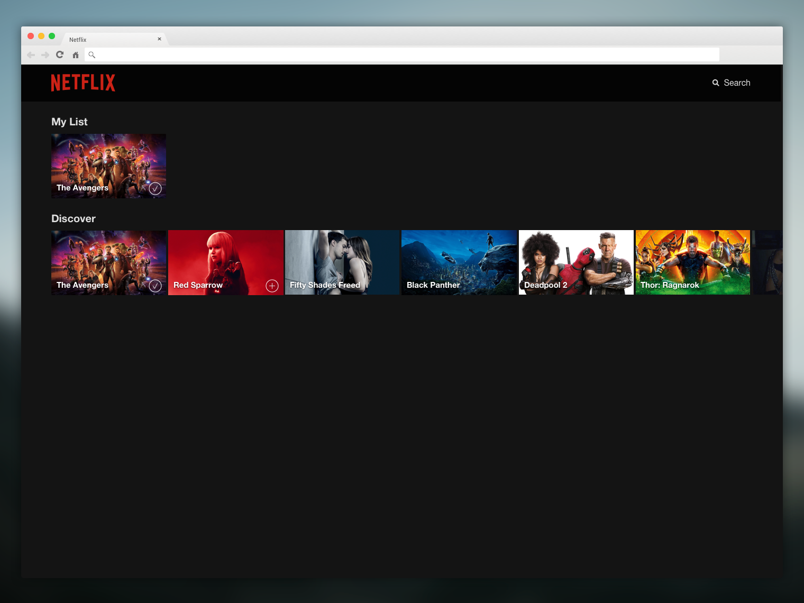

# Netflix (React-Only)

## Task Summary

In this sprint you will continue your journey into the art of creating movie theme pages. You will create a light version of netflix, allowing the user to add movies into their list. See screenshot below for your reference.

## What to expect

React is a component-based framework for building user interfaces. Expect the approach to components to seem familiar but differ from Angular and Polymer. Explore how it is much more lightweight than Angular. It still requires you to learn JSX and consider how React's virtual DOM, which makes the learning curve a bit steeper than Polymer. 

You will be using JavaScript's experimental [fetch](https://developer.mozilla.org/en-US/docs/Web/API/Fetch_API) API.

## Learning Objectives

While you are going through the sprint, keep in mind the following learning objectives. If by the end of the project you don't feel that you have accomplished these objectives, please reach out to an instructor or TA. Feel free to copy these down and make notes as you research these topics. They will come in handy down the line when you study for job interviews.

1. You will be able to define and use React components in a production-like environment.
2. You will be able to use JSX to produce React elements.
3. You will be able to understand how one-way data flow works with nested components.
4. You will be able to differentiate between container and presentation components.

## Global Dependencies
- Node
- NPM

## Getting Started

1. Fork this repo to your personal github account.
2. Clone the forked repo to your local machine.
3. `cd` into the netflix-react-only directory and run `create-react-app front-end` to create the react project in the `front-end` directory.
4. Step into the newly created folder and run your app using `npm start`.
5. Complete the requirements below. 

## Requirements

You will be building out these features:

1. Show discover movies
2. Add movie to "My List"
3. Show "My List" movies
4. Remove a movie from "My list".

Keep in mind that your code will be reviewed by your instructors and eventually potential employers. Keep your code looking professional by following a style guide.

### Seen Movie Feature

**UI Requirements**

- Every movie should have a "Add to My List button" (the one with the + sign). This button should appear only on mouse hover. If the movie has already been added into the user's list, the button shown should be the "tick" one, and when pressing it the movie should be removed from the list.

**Interaction Design Requirements**

- View should render the list of movies provided at `https://movied.herokuapp.com/discover` 
- Once a user has added the movie to "My List", the movie should show in the list above.
- If there are no movies in "My list", don't show the section.

**Note** The logic of this behavior shouldn't be on the movie render component neither in the movie list component.

## API & Postman

If you did not set this up in a previous sprint, see walk-through in the [Angular Repo](https://github.com/codeworksbcn/movied-angular-exercise) docs.

## Submitting Your Work

As usual, create a pull request on this repo, pointing to the HEAD of your forked version.

## Extra Credit

- Add another section of movies i.e. "Action" movies. That will have a lot of overlap with discover, when a movie is added into "My List", it should be shown in both discover & action lists as added.
- Persist the changes in the browser.

## FE Sprint Objectives

This is a reference to the high-level objectives for the entire 2 week sprint. This is important to keep in mind as you move through the material.

1. You will learn the different framework options you have available. 
 - Take note of what you like or don't like about each one!
2. You will learn to embrace being uncomfortable while learning new FW. 
 - As we say, get comfortable being uncomfortable! 
3. You will become confident in your ability to create something in a new lang/FW, which will come in handy because you will need to learn and use a new framework every 6mos-2yrs.
4. You will be able to start a project from scratch.
5. You will understand MVC and how this concept relates (or not) to the various frameworks in these sprints.
 - This is a common interview question. Be prepared!
6. You will be able to figure out how to setup your environment with the different toolsets needed for each sprint.
7. You will feel comfortable solving bugs using different dev tools in the browser.
8. You will get comfortable with switching between ES6 and Typescript, which you will be very valuable as the JavaScript language and ecosystem evolves.
